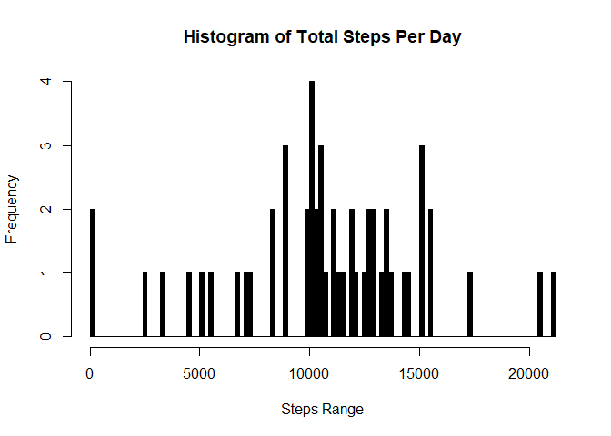
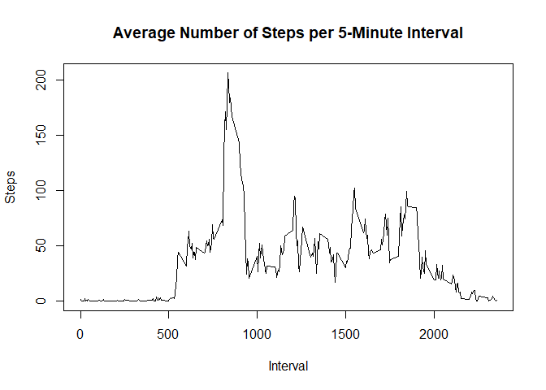
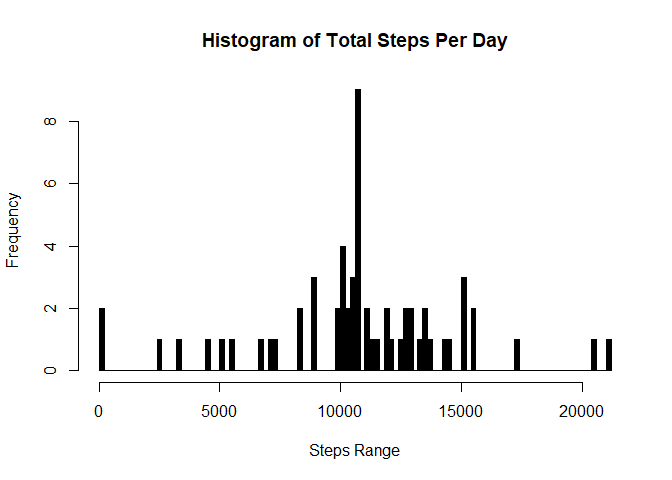
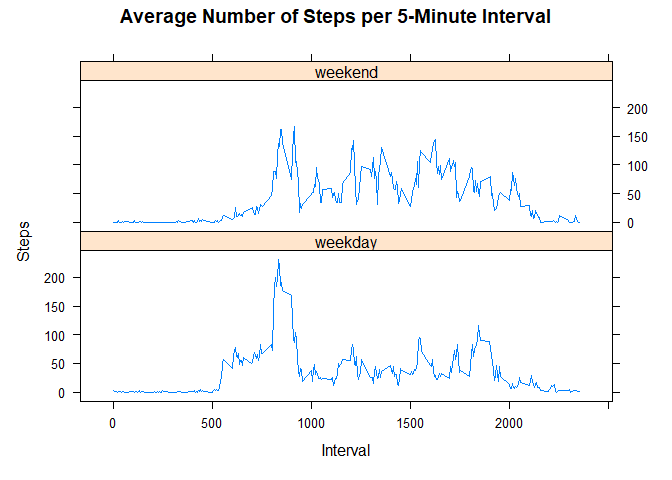

## Download and preprocessing the data

First, load the packages needed for the analysis.


```r
library(dplyr)
```

```
## Warning: package 'dplyr' was built under R version 4.2.2
```

```
## 
## Attaching package: 'dplyr'
```

```
## The following objects are masked from 'package:stats':
## 
##     filter, lag
```

```
## The following objects are masked from 'package:base':
## 
##     intersect, setdiff, setequal, union
```

```r
library(tidyr)
```

```
## Warning: package 'tidyr' was built under R version 4.2.2
```

```r
library(lattice)
```

Then load the data.


```r
unzip("activity.zip")
dat <- read.csv("activity.csv")
```

The format of the "date" column should be changed from character to date format.


```r
dat$date <- as.Date(dat$date, format = "%Y-%m-%d")
```


## What is mean total number of steps taken per day?

First, calculate the total number of steps taken per day, ignoring missing values in the data set for now.


```r
totalPerDay <- dat %>%
                subset(steps != "NA") %>%
                group_by(date) %>%
                summarize_at("steps", sum)
```

The histogram below shows the total number of steps taken each day.


```r
hist(totalPerDay$steps, breaks = 100, xlab = "Steps Range", 
     main = "Histogram of Total Steps Per Day", col = "black")
```

<!-- -->

The mean and median of the total number of steps taken per day are:


```r
mean(totalPerDay$steps)
```

```
## [1] 10766.19
```

```r
median(totalPerDay$steps)
```

```
## [1] 10765
```


## What is the average daily activity pattern?

The average daily pattern can be shown using a time series plot (i.e. type = "1") of the 5-minute interval (x-axis) and the average number of steps taken, averaged across all days (y-axis)


```r
avgPerInterval <- dat %>%
                subset(steps != "NA") %>%
                group_by(interval) %>%
                summarize_at("steps", mean)

plot(avgPerInterval$interval, avgPerInterval$steps, type = "l", 
     xlab = "Interval", ylab = "Steps", 
     main = "Average Number of Steps per 5-Minute Interval")
```

<!-- -->

The 5-minute interval, on average across all the days in the dataset, contains the maximum number of steps is calculated to be:


```r
intervalMax <- subset(avgPerInterval, avgPerInterval$steps == max(avgPerInterval$steps))
intervalMax$interval
```

```
## [1] 835
```

## Imputing missing values

There are a number of days/intervals where there are missing values (coded as NA). The presence of missing days may introduce bias into some calculations or summaries of data. We can find out whether there are biases by imputing the missing values and comparing the mean and median between the two data sets.

First, find the total number of missing values in the data set (i.e. the total number of rows with NAs).


```r
sum(is.na(dat$steps))
```

```
## [1] 2304
```

To impute the missing variables, Fill in NAs using the mean for the missing 5-minute interval.


```r
dat_noNA <- data.frame(steps = integer(0), date = character(0), interval = integer(0))
for (i in 1:17568) {
        dat_noNA <- rbind(dat_noNA, dat[i, ])
        if (is.na(dat_noNA$steps[i])) {
                dat_interval <- subset(dat, interval == dat_noNA$interval[i])
                dat_noNA$steps[i] <- mean(dat_interval$steps, na.rm = TRUE)
        }
}
```

The histogram below shows the total number of steps taken each day with imputed missing values.


```r
totalPerDay_noNA <- dat_noNA %>%
        subset(steps != "NA") %>%
        group_by(date) %>%
        summarize_at("steps", sum)

hist(totalPerDay_noNA$steps, breaks = 100, xlab = "Steps Range", 
     main = "Histogram of Total Steps Per Day", col = "black")
```

<!-- -->

The mean and median of the total number of steps taken each day are:


```r
mean(totalPerDay_noNA$steps)
```

```
## [1] 10766.19
```

```r
median(totalPerDay_noNA$steps)
```

```
## [1] 10766.19
```

Imputing missing data on the estimates of the total daily number of steps did not seem to impact the mean and median of the data. Therefore, the presence of missing data did not seem to bias the calculations of the data in the this case.

## Are there differences in activity patterns between weekdays and weekends?

Create a new factor variable in the dataset with two levels - "weekday" and "weekend" indicating whether a given date is a weekday or weekend day. We will use the data set with missing values imputed.


```r
dat_noNA$day <- weekdays(dat_noNA$date)
dat_noNA$day <- factor(dat_noNA$day == "Saturday" | dat_noNA$day == "Sunday", 
                       labels = c("weekday", "weekend"))
```

The time series panel plot shows the 5-minute interval (x-axis) and the average number of steps taken, averaged across all weekday days or weekend days (y-axis).


```r
avgPerInterval_noNA <- dat_noNA %>%
                group_by(interval, day) %>%
                summarize_at("steps", mean)

xyplot(steps ~ interval | day, data = avgPerInterval_noNA, type = "l", 
       xlab = "Interval", ylab = "Steps", 
       main = "Average Number of Steps per 5-Minute Interval", layout = c(1,2))
```

<!-- -->

It can be observed that for weekdays, the number of steps do not exceed 200 in a given interval, and the pattern is consistent throughout the day. However, on the weekends, we see a spike in number of steps between the intervals 800-1000, and reduces for the rest of the day. 
